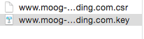
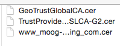

Recently one of our company customer asked us to use https instead of http for their node based website. The logic is simple: buy the ssl certificate (.cer file), and then use them in your node server code. There are three steps in order to do that.

### Step 1: Generator CSR (Certificate Signing Request)

The CSR file is used for buying the ssl certificate. We need to generator by code. There is a very good tutorial on this: [SSL Certificates Help](https://www.godaddy.com/help/apache-generate-csr-certificate-signing-request-5269).

Basicly you just need to run this command in your terminal: \$openssl req -new -newkey rsa:2048 -nodes -keyout yourdomain.key -out yourdomain.csr Please note that you should write your complete domain name as parameters here.

After typing this command, you need to input some information such as country code, province.. But the most important informaiton is still your domain name, but here it is called **Common Name**. Please input your complete domain name for the common name.

After that, you will get two files: .csr file and .key file, like the screenshot below.



### Step 2: Buy the ssl certificate in the hosting websites

The second step is to buy the ssl certificate on the hosting website. I believe they provide this kind of service, such as goDaddy. There are also ways to create the ssl certificate files on our own, but it is less handy and that's why there is still such business to sell ssl certificate :)

The price shouldn't be expensive. Mine is 10 euros for 2 years for a single website.

While purchasing the certificate, you need to input the string in the .csr file into the website in order to get it done.

After this step, you should be able to get the ssl certificate files. This is what I get:



### Step 3: Change your code in your node server

Here comes the most interesting part!

Let me list a easy example:

server.js

```js
// get all the tools we need
var express = require("express")
var app = express()
var httpapp = express()
var port = process.env.PORT || 80
var https = require("https")
var http = require("http")
var fs = require("fs")

// use the .key file and .cer file for setting up https server
var options = {
  key: fs.readFileSync("www.********.com.key"),
  cert: fs.readFileSync("www_*********_com.cer"),
}

app.configure(function() {
  app.use(express.static(__dirname + "/views"))
  app.use(express.logger("dev"))
  app.use(express.cookieParser())
  app.use(express.bodyParser())
})

//redirect http request to https request
httpapp.get("*", function(req, res, next) {
  res.redirect("https://" + req.headers.host)
})

//80 is the default port number for http server
http.createServer(httpapp).listen(80)

//443 is the default port number for https server
https.createServer(options, app).listen(443)
```

Basiclly, we need to build to app from express.js, one for http server, and the other one for https server in order to redirect http request to https request. If there is no redirect, our website will support both `http//yourdomainname` and `https://yourdomainname`, and http will be in default instead of https, and that's why we need redirect.

Alright, after this you just need to restart the server, and see the magic happens. Thanks for reading!
