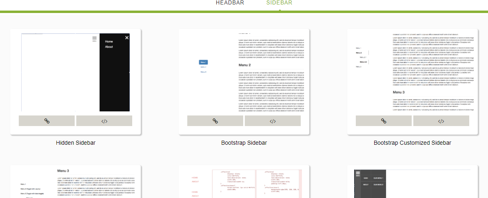

Recently, I start to discover the common practice for web design and web development. I find that almost all the articles about web design talk about how the interaction looks like, but don't talk about how to implement that, so I am doing the work and summarize common pratice for web design and development. Now I have sorted out common practice for sidebar, headbar. I will discover and add to the collection:

[Here](https://albertwhite.github.io/common-practice-for-headbar-and-sidebar/) is the project.
Thanks for reading and welcome for any feedback or opinions!
