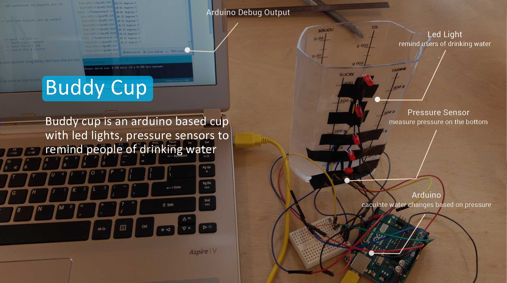
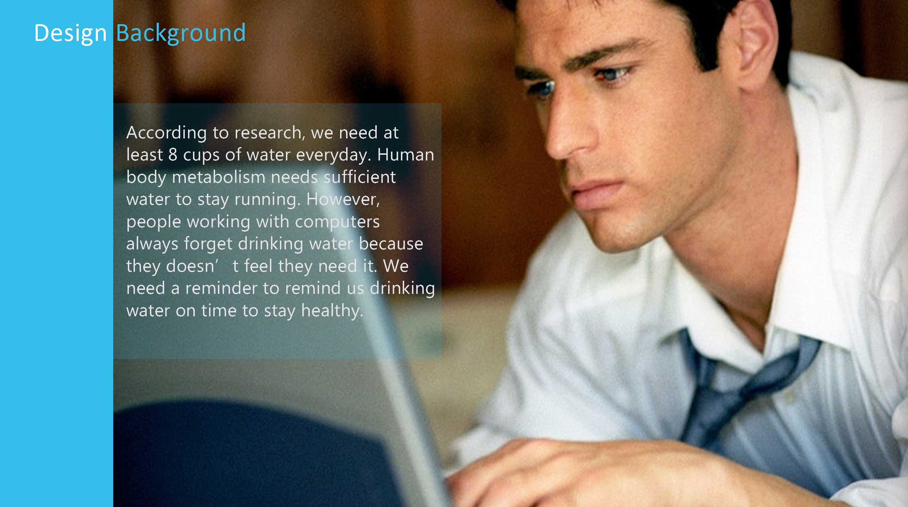
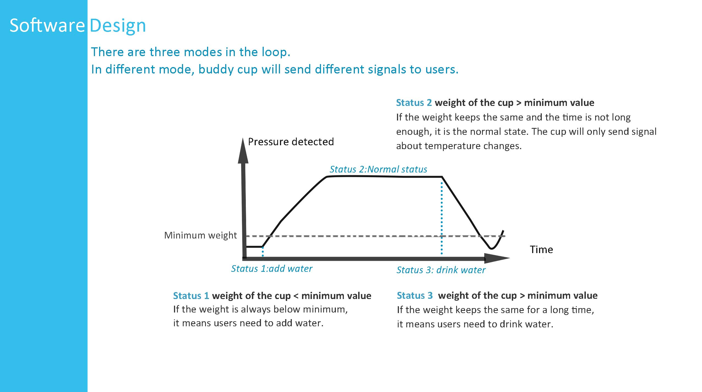
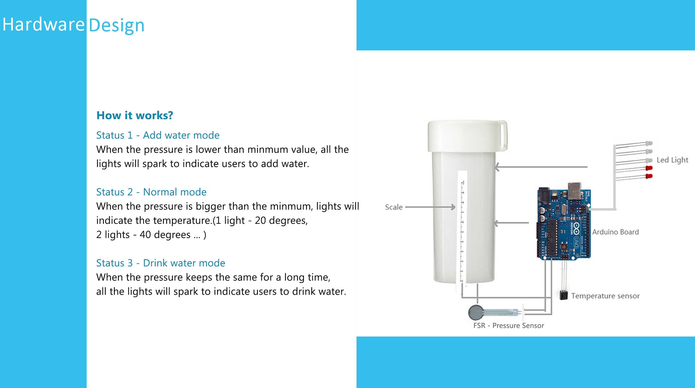
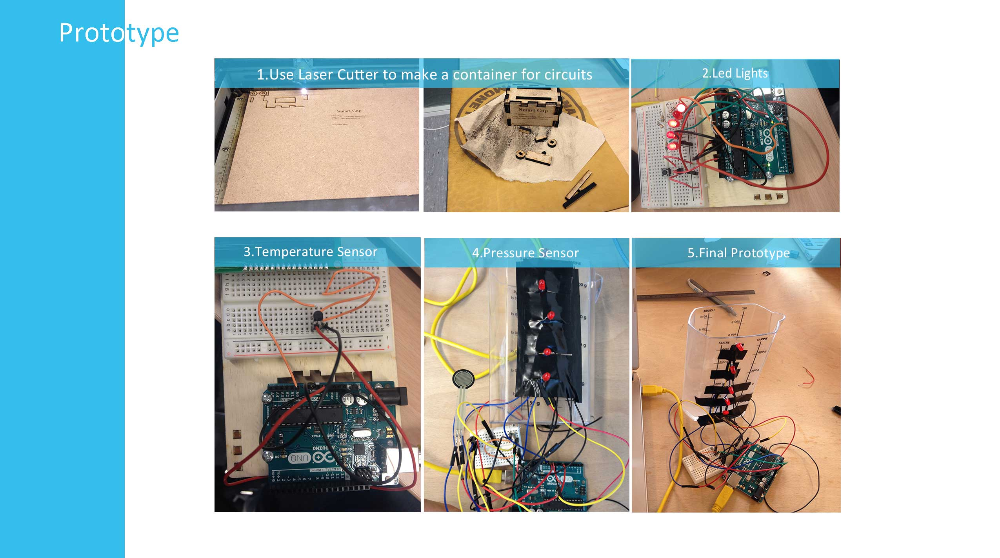

Buddy Cup is a arduino based cup with pressure sensor to remind people of drinking water. It is my project in creative design class in 2014.

I spent most of the time in designing the algorithm to notify people to drink water on time. It is also quite fun to make the box for all the wires and sensors with laser cutter.

