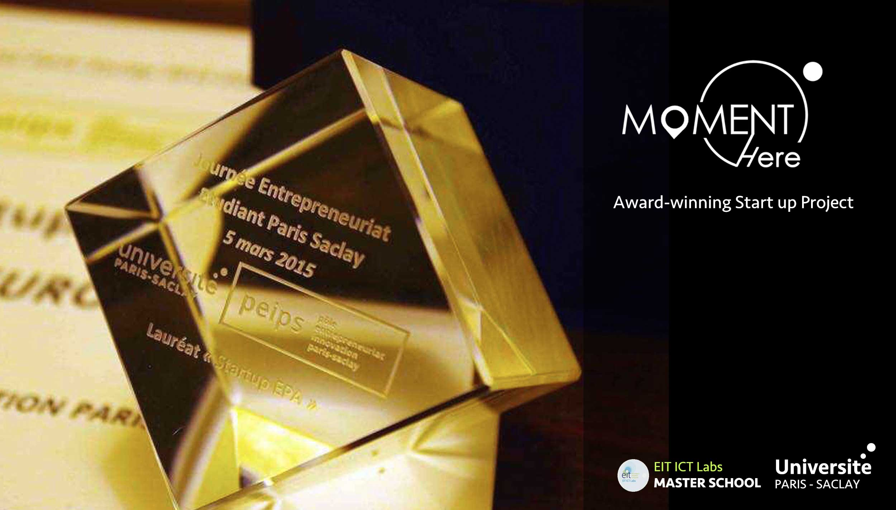
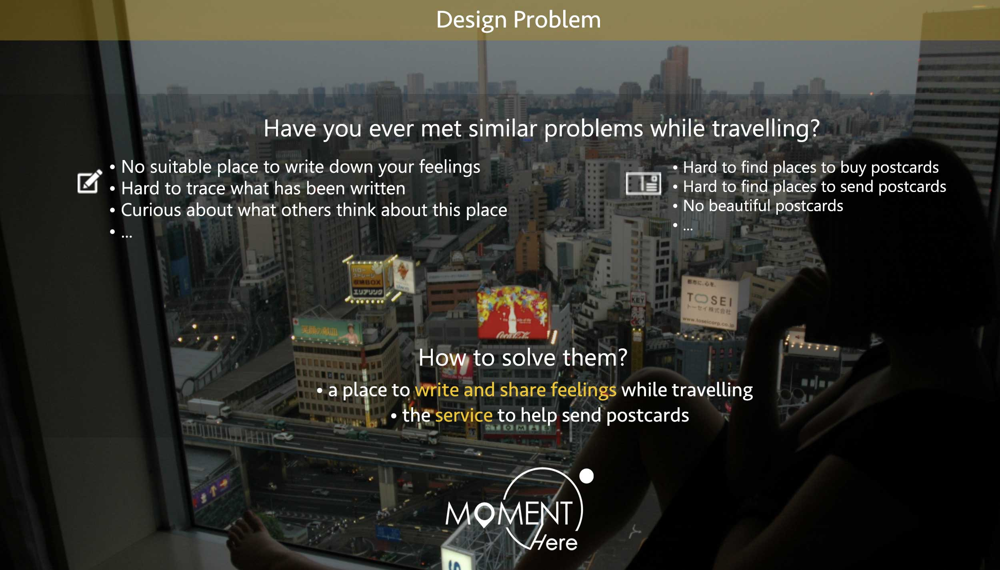
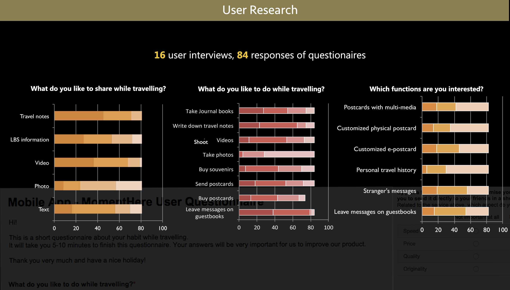
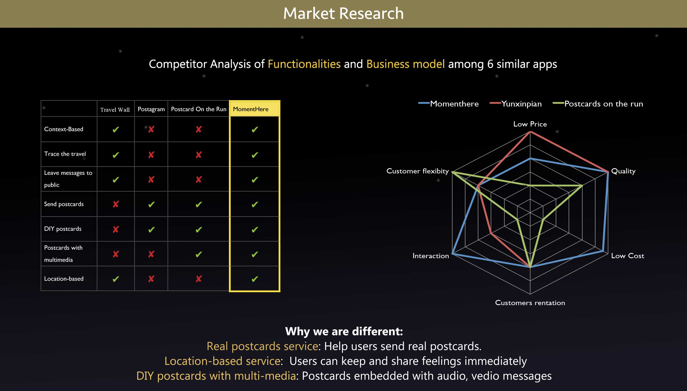
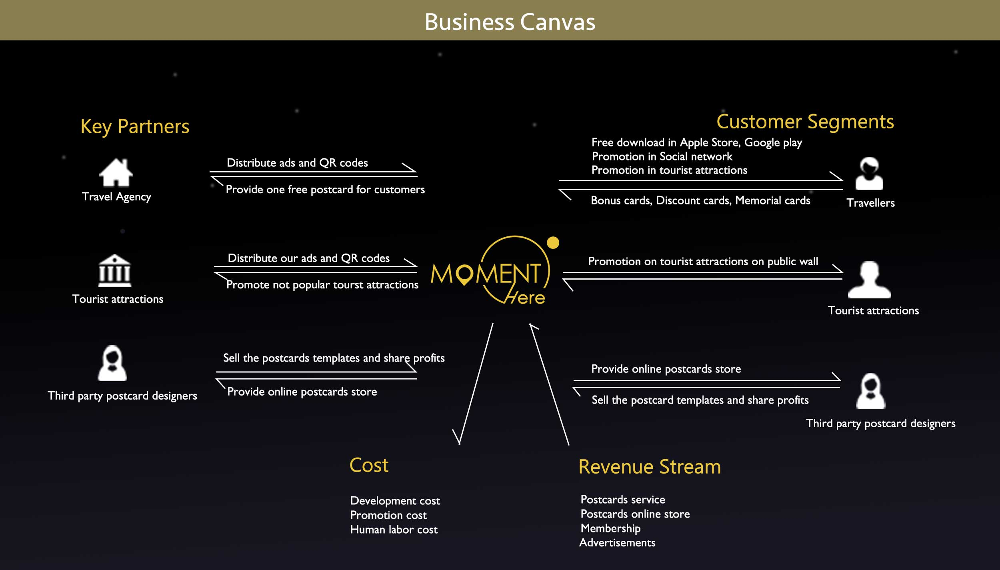
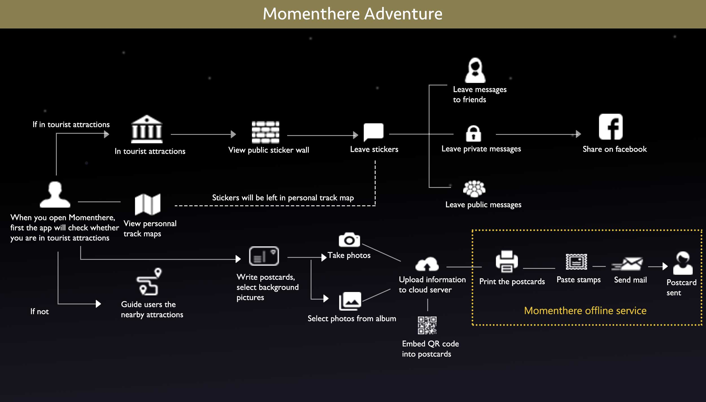
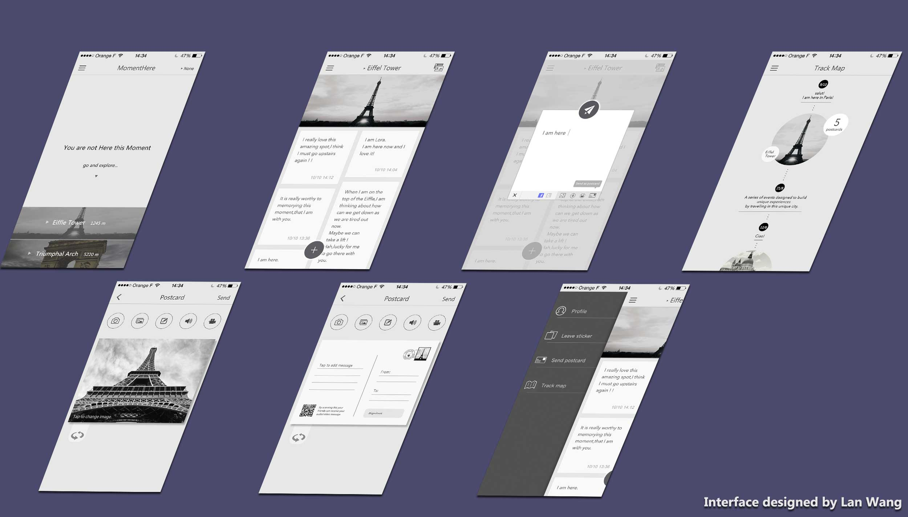

Momenthere is a location based app to keep and share feelings for travaillers. Users can leave their feelings or send postcards to others via our app based on their current location. The project is the main project for our BD lab course in EIT ICT Master School in 2015. The project wins the 5th JEE contest. Our app is aleardy on Google Play. I am responsible for developing the server side and part of the client side of the app.

