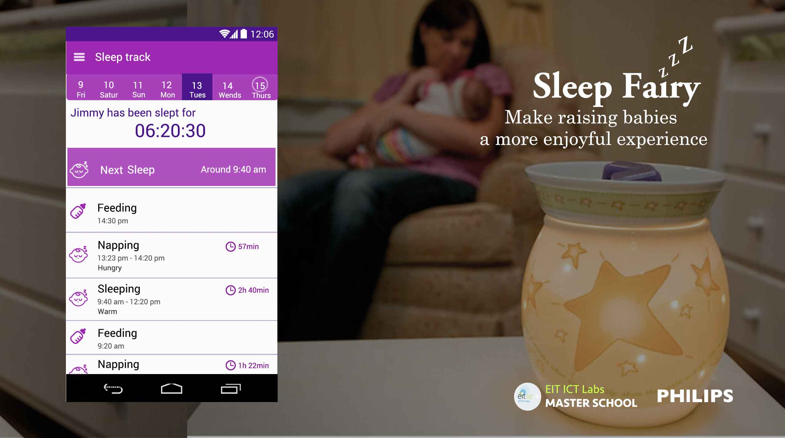
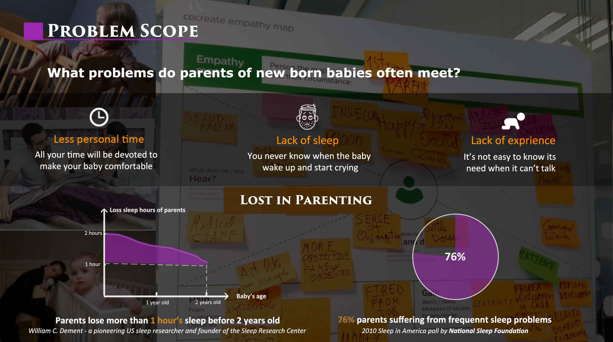
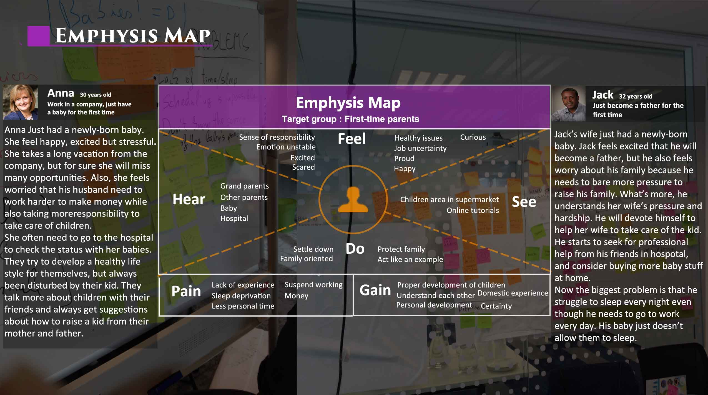
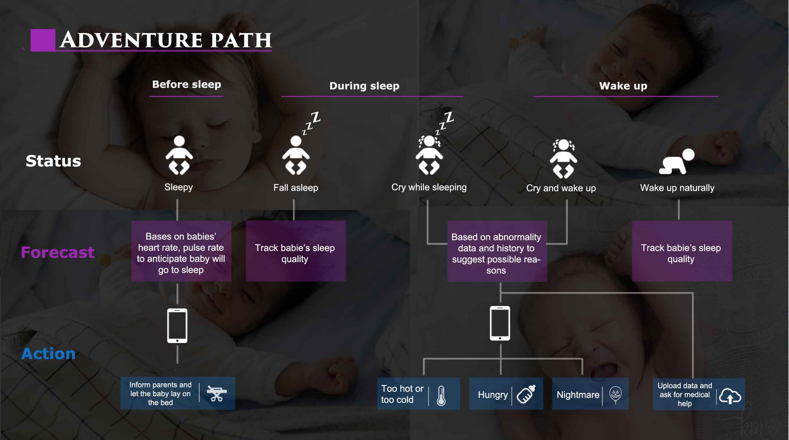
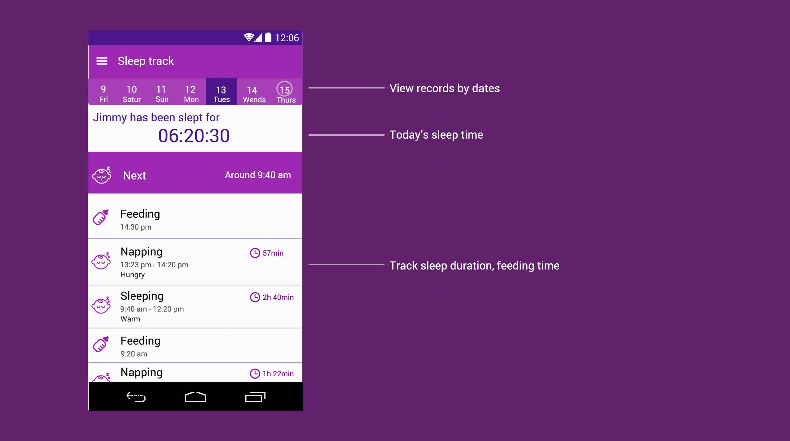
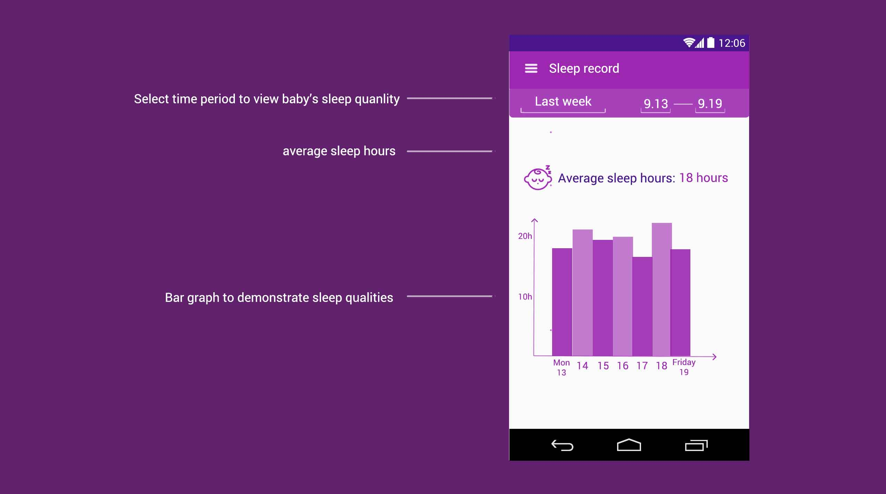
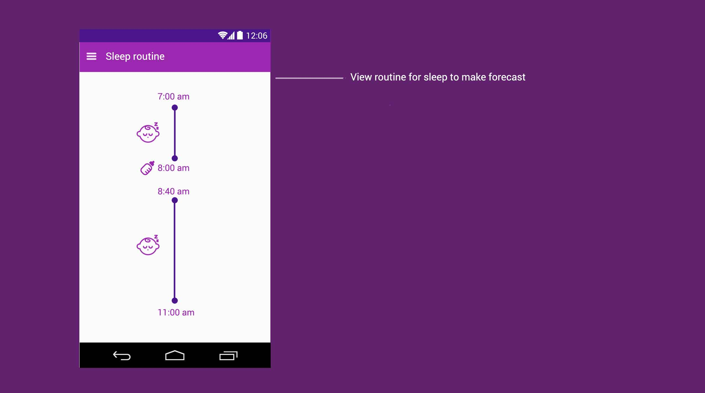
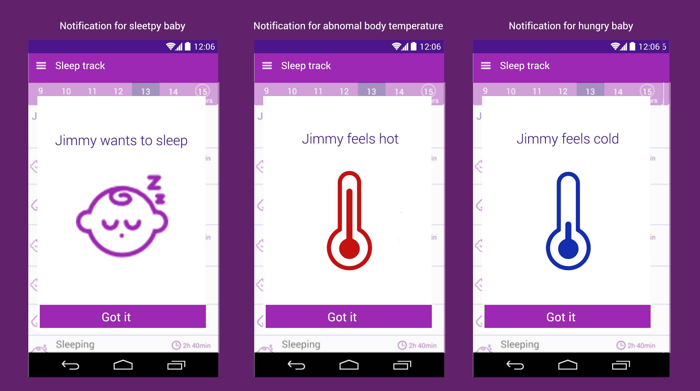
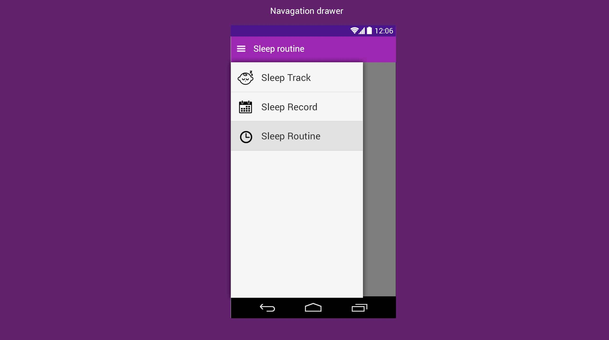

Sleep Fairy is an android app to help parents recognize babies' sleep paterns by tracking and forecasting baby sleep status. The project is for the summer school of EIT ICT labs master school in Eindhoven in 2015. The idea is based on the AVENT system from Philips.

