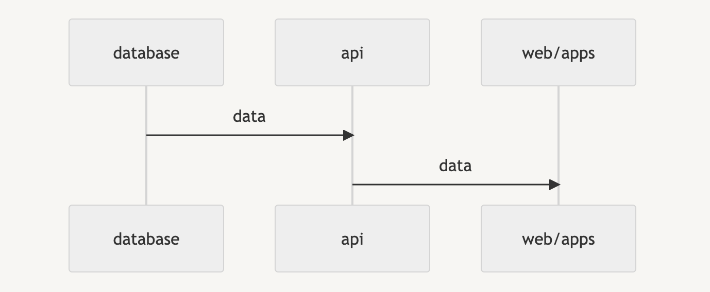

When I work in the frontend, we can always release any change whenever we want (the only risk is that during the release, there might be several minutes when the server has to shift from the old version to the new version, but it's not a big problem at all). 

However, when I started to work in the backend, I noticed that changes could be breaking changes, and we cannot release them right away. So what are the breaking changes in that case, and why might they "break" something ?

### Context

- Frontend (web/app) fetches data via API. API retrieves data from the database. 
- If an API changes (either response or payload), it may break the frontend, because the frontend still consumes the old API.
- When the api is used by app, we should take extra attention because we cannot modify the already installed apps (unless we force all the users to update their apps). It means the api should be **retrocompatible** with old versions of apps, unless old versions of apps are all upgraded to the new version with the new API.

Let's go deeper into the subject for API and Database.

### RestAPI and Graphql

The following changes will break the frontend if nothing is done in the frontend:

- Add new required params / rename required params in request payload
- Remove a field which is being used from the response
- Rename a field which is being used from the response

As we can see, the only safe operation is to "add" a new field, which will break nothing, thus, when we want to update the name of a field, a common way to update a new field is to add a **fieldV2** while deprecating the old field, and really deprecating the old field once it's not used in any frontends.

When we want to remove a field, we should wait until it's not used in any apps.

If the payload has a breaking change, it's a bit complicated because we cannot release the backend and frontend at same time. In this case, it's better to create an "apiV2", release the new api, then implement the frontend to use the apiV2 and release the new frontend. Finally, if the old api is no longer used, we can remove it in the backend.

### Database migration

Database migration could bring breaking changes too. For example, when a column is renamed or removed, the interaction with the database might break the server because it cannot find the column.

First of all, it's better to make the database migration and SQL interaction update separately. If we do PRs, it's better to create two separate PRs, one for database migration, another one for data infrastructure modification.

Then, if we want to rename a column, it's dangerous to rename it right away. Like what we do when we want to rename a field in API response, we could create another column, make the migration, fetch data from this column, and finally remove the old column.

If we want to drop a column, we need to refactor the data infrastructure layer to remove the usage, before making the migration.

If we need to create a new column, it's better to create the column with "default null", so the service will not throw errors when it fetches data.

Thanks for reading !
