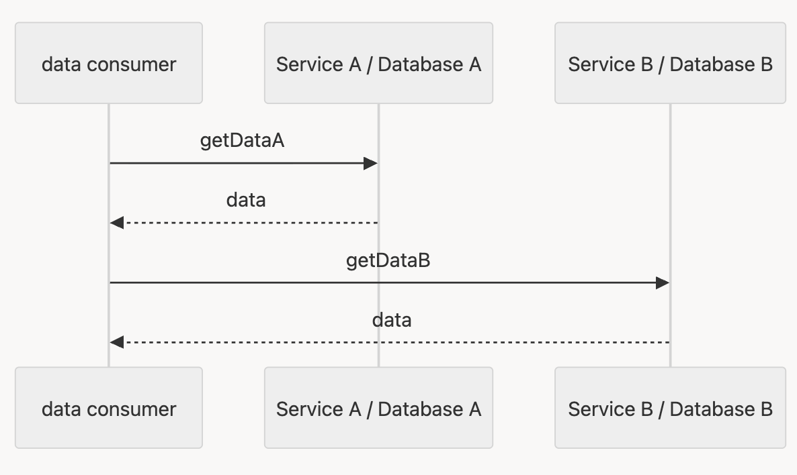
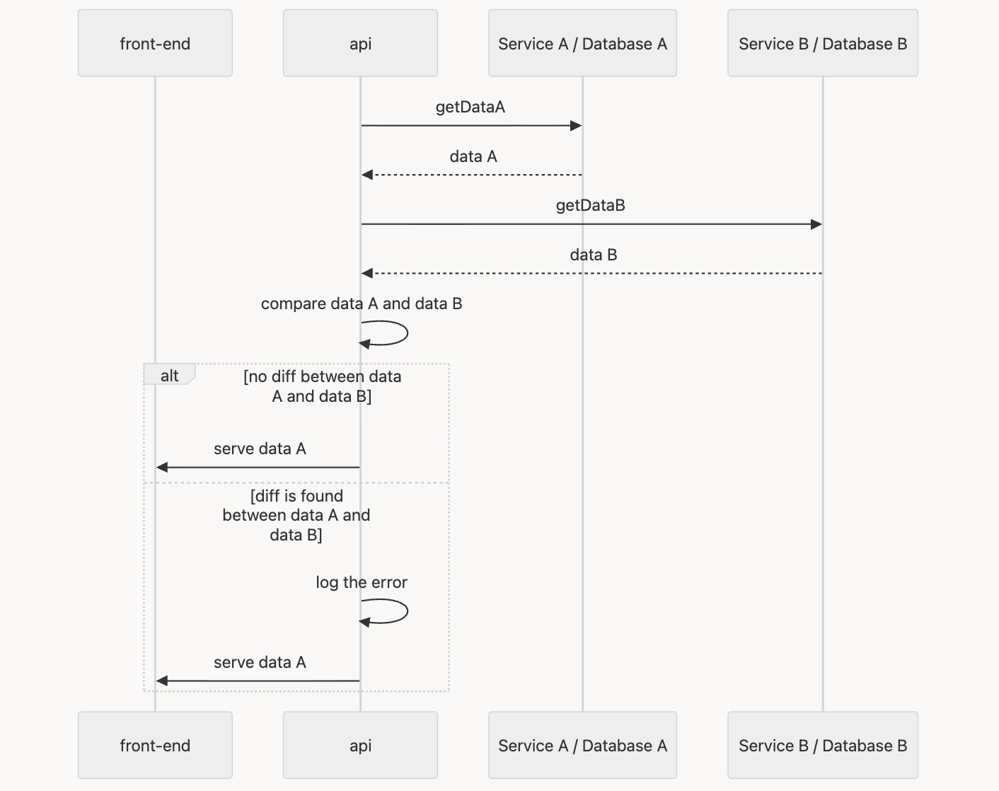
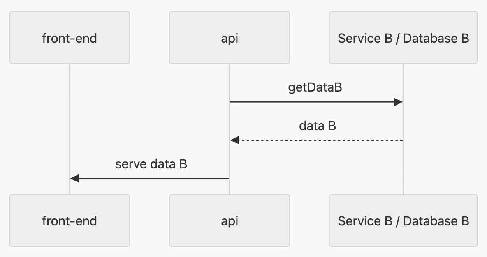
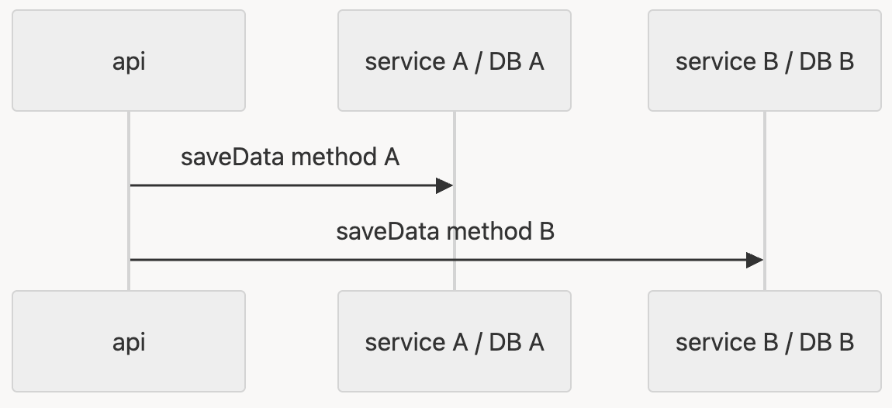
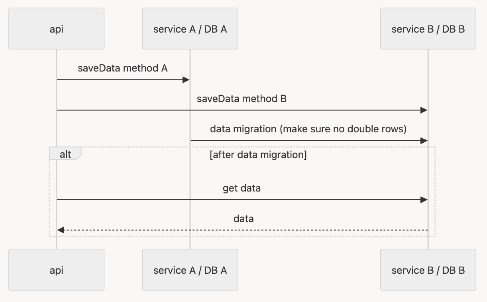
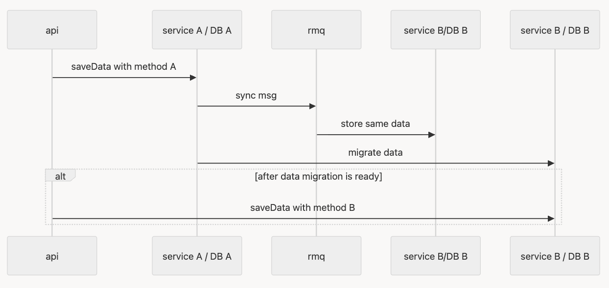
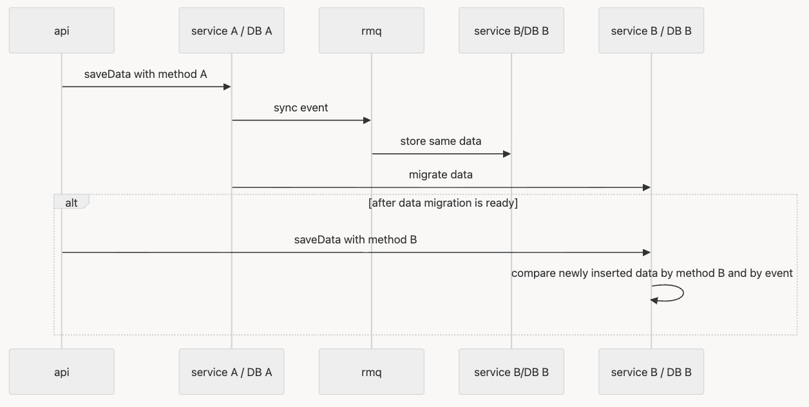

Reading from or writing into a new data source can be tricky and challenging.

For example, before we read data from DB A via method A, after the migration, we want to read data from DB B via method B and they should return the same data. Or, another example, before we write data into DB A, and with the migration, we will write data into DB B, in the end, DB B needs to contain full data from DB A.

There are common strategies to handle these technical challenges.

## READ from two data source

Imagine the scenario that api reads data from DB A with method A, and in the future, the api reads data from DB B with method B.

The challenge is: how to make sure data reading from DB A and DB B has no discrepancy at all ?

In order to do so, before serving the data to the front-end, the api could make an internal data comparison and log the data discrepancy, but in the meanwhile, always serve the data of the old data source (method A with DB A).

When there are no more data discrepancies, we can decommission the reading from DB A with method A.

## WRITE into two data source

Migration with data writing is more tricky, because it concerns data migration.

Imagine the following case: the api calls service A and service B in the same time and save data into two DB separately, but the challenge is the new DB (DB B) doesn't contain legacy data from DB A, so DB B cannot be used for data reading yet.

In this case, there are two options:

#### Method migration first, data migration next

Most naturally, we let the api to call service B and service in the same time and store the new data in both DBs.

In order to let DB B contain full data, we just need to do the data migration from DB A to DB B (while make sure no duplication of data), and after that, we can start to READ from DB B with the strategy we introduced above.

But sometimes, if the method migration is too complex, for example, there are 10 flows to migrate. In this case, we can consider migrating the data first and make sure data integrity between two DB, and migrate the flows gradually later.

#### Data migration first, method migration next

In the following example, we introduce the event based system to sync data between new database and old database when there is data inserted into old database.

After DB B is sync with the new data inserted into DB A. We can start to do the data migration, and after the data migration, we can implement the writing to DB B directly.

If we want to make sure data integrity for newly inserted data between method A and method B, we can introduce internal jobs to compare data.

## Summary

No matter whether you are reading from two sources, or writing from two sources, the most important thing is to make sure there is no data difference with two ways of reading or writing. In this article, we introduced common strategies to make sure the data integrity.

Thanks for reading !
