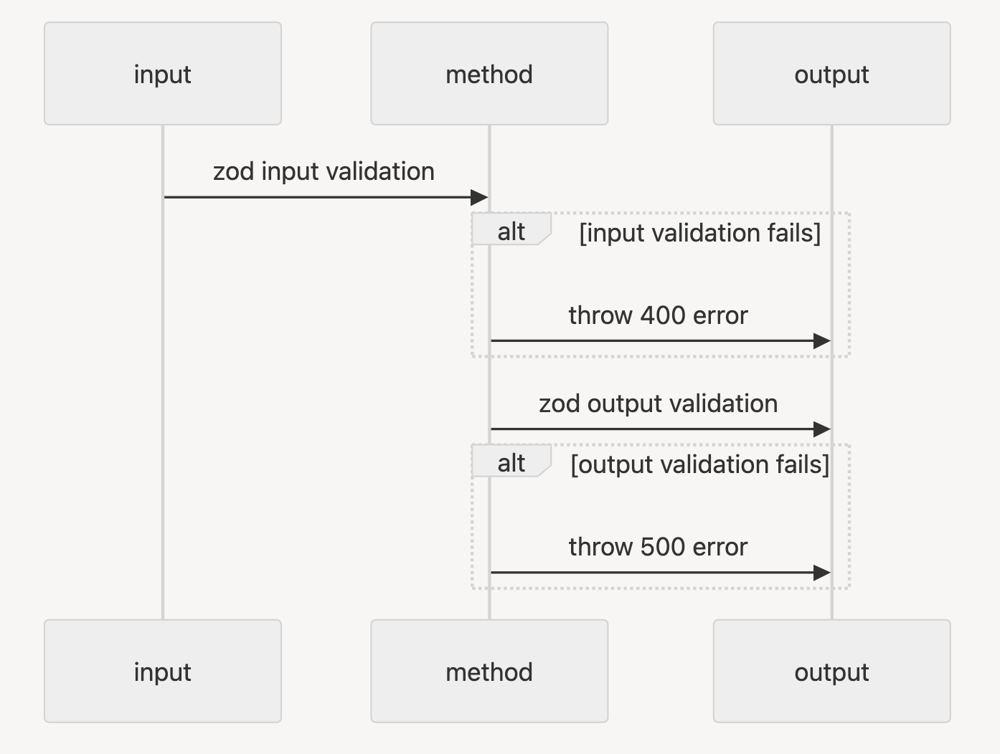

The concept of domain driven design (DDD) already exists in REST api. For example, when we develop an express server, we differentiate between **routes** (application layer), **handlers** (domain layer) and **clients** (infrastructure layer). As well, micro-service could follow the same guideline.

### Why Domain Driven Design for a micro-service

We would like isolate **dynamic** business logics from the "static" parts (method definition, how to interact with db).

As well, we would like to isolate business logics by **domain**. For example, 'Author' related logic and 'Book' related logic should not be written in the same file.

In conclusion, with DDD, we can concentrate on the dynamic functional logic (business logic) by domain. Domain logic is the key to functional features (and might not be very possiblily replaced by AI because as human we need to finger out all the scenarios :D ).

### What are the Domain Driven Design layers

For DDD in a micro-service, there should be:

- Application layer: expose method name / route, input / output validation
- Domain layer: business logic, error design
- infrastructure layer: interact with db or external client

The calling order should be from top to bottom (application layer calls domain layer, domain layer calls infrastructure layer), not the reversed way.

However, when we really develope, I propose to develop from bottom to the top (first infrastructure layer, then domain layer) so we can test the business logic directly.

### Application layer

Inside application layer, we define:

- The exposed method name (if it's json-rpc method), or route name
- Input, output schema with Zod / Joi and infer type for typescript. The type can be reused in other layers or even in other components
- Type validation with input, output schema



Define schema and infer type:

```js
import { z } from "zod"

// Define a Zod schema
const inputSchema = z.object({
  id: z.number(),
  name: z.string(),
})

// generate type from zod schema, to be reused in domain layer
type InputType = z.infer<typeof inputSchema>
```

Type validation:

```js
try {
  // Validate the input data
  inputSchema.parse(inputData)
} catch (error) {
  throw new Error("validation fails") // server should throw 400 error
}
```

### Infrastructure layer

In infrastructure layer, we define:

- CRUD method for a single database entity
- Or join multiple tables to get / update data. Only simple query, no business logic

### Domain layer

Domain layer will call infra layer to return results or throw error for Application layer. Sometimes it's only pass through, but for real it is more complicated, because we need to **think of all the scenarios** and **design related errors**.

For example, if we want to update an entity, besides the success scenario, we need to define and throw errors for the following cases:

- Entity is not found
- User doesn't have the right to update the entity
- DB updates fails

Each failure scenario should match a customized error. This error will be thrown from micro-service to api side, then api will parse those errors and throw a proper API / Graphql Error to the client side.

Thanks for reading !
