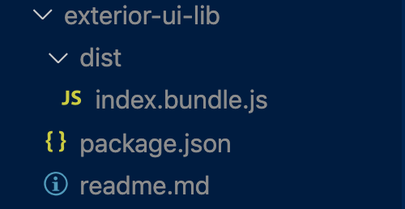

[Read this article on medium](https://medium.com/@albertyuebaixu/react-design-system-with-typescript-and-storybook-1a99cdba24c6)

A design system should serve two things: export shared components, and show what shared components we have.

In this article, I will cover some technical details on the popular implementation of a design system with React + TypeScript + Storybook.

Here is the [source code](<(https://github.com/AlbertWhite/react-design-system-with-typescript-storybook)>) and an [example project](https://github.com/AlbertWhite/react-demos/blob/master/demo44-use-exterior-lib/src/App.js) to import and use it.

Let’s GO !

#### 1. Webpack Configuration for JS library

First of all, how do we create a system for sharing components? There are two choices:

The first choice is to export jsx files directly, without compiling.
The second choice is to compile the es6 jsx code components into es5 and export the bundle code.

It depends on how we want to use it. If the component uses typescript, but the project who imports it doesn’t use typescript, then it is not possible to import it directly. If the webpack configuration of the main project allows a mixture of javascript and typescript, it won’t be a problem to import typescript components directly.

In this article, let’s imagine that you choose the second choice. It’s more technically challenging.

Like other jsx projects, we need webpack and babel to compile. However, the Design system is not a SPA (Single Page Application), but a javascript library with lots of exports.

**Technically, extra configurations are needed in Webpack if it is used for creating bundle for js libraries.**

Here is the [official doc for webpack](https://webpack.js.org/guides/author-libraries/) about how to authoring libraries. It's long but worth to read, but if you want to know the key differences, here it is, in the config of webpack:

```js
output: {
    filename: 'index.bundle.js',
    path: path.resolve(__dirname, 'dist'),
    library: 'exterior-ui-lib', // used for creating a lib
    libraryTarget: 'umd', // used for creating a lib
    umdNamedDefine: true, // used for creating a lib
  },
```

Here is the [webpack configuration in the demo](https://github.com/AlbertWhite/react-design-system-with-typescript-storybook/blob/master/webpack.js). Another trick for webpack in Design system is that there is no dev mode. Development mode can be implemented with storybook directly.

#### 2. Component structure: Atomic design

The idea of Atomic design was pioneered by [Brad Frost](https://bradfrost.com/) in 2013. This design concept is also very useful for organizing the components in Design system. The five core concepts are:

1. Atoms: Basic HTML controls
2. Molecules: Combined HTML controls, group inputs etc
3. Organisms: Footer, Header, ...
4. Templates: Layout
5. Pages

It’ s not urged to use Atomic Design for your storybook, but it will give you an idea on how to organize the components in different levels.

#### 3. How to export components

Design system is a javascript library. Like any library, it should be easy to use, easy to look for what we need.

In the [index.js](https://github.com/AlbertWhite/react-design-system-with-typescript-storybook/blob/master/src/index.tsx), a recommended way for exporting:

```js
export { default as Link } from "./components/atoms/Link"
export { default as Text } from "./components/atoms/Text"
export { default as Box } from "./components/atoms/Box"
```

then in the project who imports the design system, we can easily import the components by

```js
import { Text, Link, Box } from "exterior-ui-lib"
```

#### 4. Manage the Dependencies in package.json

If the components in Design system are already compiled,we don’t need to add any dependency in package.json. Dependencies like react, react-dom should be in peerDependencies, and other dependencies can be in devDependencies.

Then, in the “files” configuration in package.json, we only need bundle.js, so the package.json will be like this:

```js
 "files": [
    "./dist/index.bundle.js"
  ],
  "dependencies": {},
  "peerDependencies": {
    "react-dom": "^16.13.0",
    "react": "^16.13.0"
  },
  "devDependencies": {
    //... the rest dependencies
  }
```

Here is the [full example](https://github.com/AlbertWhite/react-design-system-with-typescript-storybook/blob/master/package.json) for package.json.

In this way, after we make the npm install, the design system library will be very light:



#### 5. Version management

An update of the library needs to be accompanied with a new version in package.json. If the project is hosted on git, a new tag will be pushed for the new version.

In Terminal, the commands are:

```js
npm version //update package.json and create a new tag
git push --follow-tags // push tags
```

And then we can update the version for this dependency in package.json of the main project who imports it:

`"exterior-ui-lib": "git+https://github.com/AlbertWhite/Styled-system-and-storybook.git#v1.0.11"`

#### 6. Storybook

Storybook is necessary for a react based Design system, to be able to demonstrate and debug.

The official tutorial of storybook is well written, and here is my [storybook config with typescript](https://github.com/AlbertWhite/react-design-system-with-typescript-storybook/blob/master/.storybook/main.js) in the demo..

#### 7. Optional: Typescript

We can also integrate typescript in Design system just by adding some extra config for webpack, and creating tsconfig.js for configurer typescript. The official documentation is well written, or you can check how it is done in the [demo](https://github.com/AlbertWhite/react-design-system-with-typescript-storybook)

#### 8. Optional: Styled System

[Styled System](https://styled-system.com/) lets you quickly build custom UI components with constraint-based style props, which means, you can add js-like props to control css. It's built upon styled components.

Styled system is really useful to create container components, for example `<Box>`, `<Flex>`.

Here is an example:

The definition of [a component](https://github.com/AlbertWhite/react-design-system-with-typescript-storybook/blob/master/src/components/atoms/Box/index.tsx) with styled-system:

```js
import styled from "styled-components"
import { color, ColorProps, space, SpaceProps } from "styled-system"

type BoxProps = ColorProps & SpaceProps

const Box =
  styled.div <
  BoxProps >
  `
  ${color}
  ${space},
`

export default Box
```

The use of it in [another](https://github.com/AlbertWhite/react-demos/blob/master/demo44-use-exterior-lib/src/App.js)

```js
<Box marginTop={"180px"}>
  <Text>Hello world</Text>
  <Link href="https://www.google.com">Hello world</Link>
</Box>
```

Here is the full demo for the [design system](https://github.com/AlbertWhite/react-design-system-with-typescript-storybook) and a [sample project](https://github.com/AlbertWhite/react-demos/blob/master/demo44-use-exterior-lib/src/App.js) to use it.

Hope this article helps you! Thank you for reading this article!
