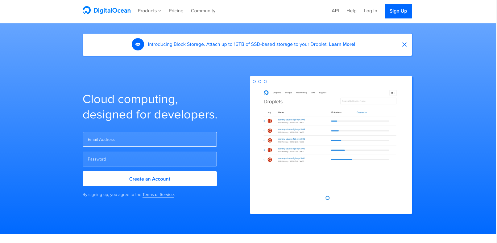
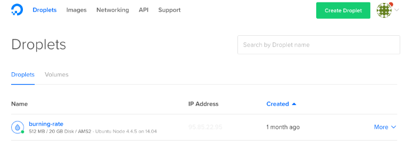
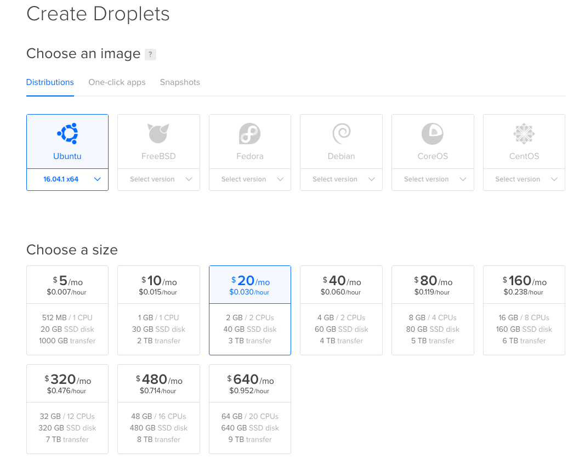
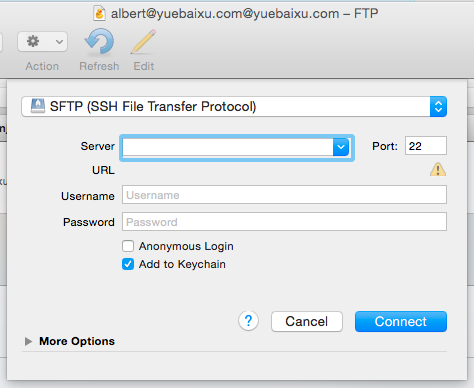

It is my note about how to deploy node server to DigitalOcean.

### 1. Create a virtual server in DigitalOcean

[DigitalOcean](https://www.digitalocean.com/) provides service for cloud computering, which means it provides unbuntu servers to let users host servers.

Each virtual server is called as **Droplets** in DigitalOcean. Creating a droplet means creating a virtual server in DigitalOcean.

Then we need to choose an image for virtual server and choose the monthly plan for that.

After creating the droplets, we can start to use the ip address for this droplet to place our files.

### 2. Transfer files with SFTP protocol

The second step is to using SFTP (SSH File Transfer Protocol) to transfer server files in the virtual server.

We can use command line, or use some tools, such as **CyperDuck** to finish the task.

In CyperDuck, we need to select SFTP protocol, select the 22 as port number, and enter the ip address for the virtual server in DigitalServer. As for the username and password, we can use 'root' as the username, and password can be send by DigitalOcean with email. We can also create other users in the virtual server and use the other user name and password to connect to CyperDuck.

After connecting with CyperDuck, we can put the files in /home directory.

### 3. Use PM2 node module to launch node server

PM2 is a production process manager for Node.js. We need to access the node server file in command line and install the pm2 node module by the command `$ npm install pm2 -g`.

In order to access the node server file in command line, we need to use ssh. By using the command `$username@ip address` and entering the password, we can access to virtual server with SSH protocol.

After accessing to the virtual server, we can install PM2 node module and use it by the command `$pm2 start server.js`.

There are some other useful commands for PM2, such as the command to stop the virtual server `$pm2 stop server.js`, sometimes we need to kill all the processes by `$pm2 kill`, and restart the server by `$pm2 restart server.js`.

### 4. Purchase a domain and redirect the domain to the virtual server's IP address

After the last three steps, we can already visit the web app by inputting the ip address in the browser.

But an ip address is not enough, we need a domain name, which is easy to be used and remembered by users. We can purchase domain names in lots of domain name deals such as [Go Daddy](https://godaddy.com/) or [Versio](https://www.versio.nl/).

After purchasing a domain name, we need to redirect the domain name's ip address to our virtual server's ip address in DNS (Domain Name System). For example:

Thanks for reading!
