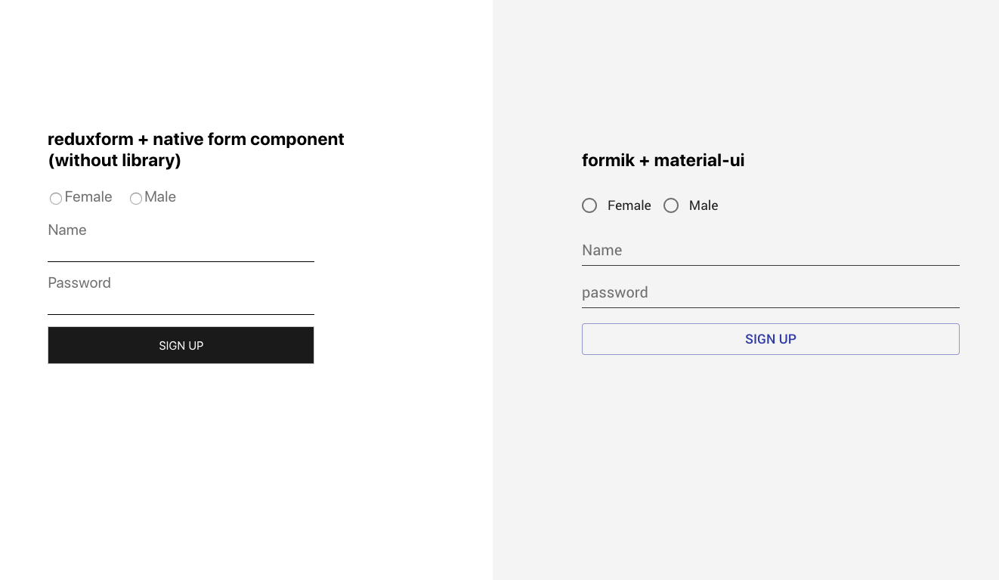

Form is one of the most important part in web application. When we work with a form, there are so many things that are quite similar, for example: form validation, intial values, error message, catch error after submission... That is why a form library can be quite useful (although we can create our own form library).

Material-UI provides form control component with styles and functions already integrated. They can be useful but sometimes they can create problems, just like Bootstrap.

### The choose between redux-form and formik

In terms of form library, two of the most recommended ones are: [Redux-Form](https://redux-form.com/8.1.0/) and [Formik](https://jaredpalmer.com/formik/) . What are the advantages and hidden disavantages behind them?

First of all, both of them are well designed. The fundamental features are supported in different way. Formik works as a wrapper component without passing data to redux store and reducer, redux-form works as a HOC and all data are passed by redux store.

They are quite similar in terms of features:

- Render form Field
- Sync Form validation
- Form submission and catch error
- Initial values

Some more advanced features include:

- Stop submit
- Pass the field, form status props to the field (touched, error, submitting...)
- Reset form after submission

[Basic example with redux-form](https://github.com/AlbertWhite/react-demos/blob/master/demo39-formic-materialUI-vs-reduxform/src/formContainer/reduxForm/index.js):

```js
import React from "react"
import { Field, reduxForm } from "redux-form"
import { selfValidation } from "../../validation/selfValidation"
import { submitWithReduxForm } from "../../action"

const formSubmit = (values, dispatch) => {
  dispatch(submitWithReduxForm(values))
}

const Form = ({ handleSubmit }) => {
  return (
    <form className="reduxForm" onSubmit={handleSubmit(formSubmit)}>
      ....
      <Field component={Input} type="text" name="name" label="Name" />
    </form>
  )
}

export default reduxForm({ form: "someForm", validate: selfValidation })(Form)
```

[Basic example with formik:](https://github.com/AlbertWhite/react-demos/blob/master/demo39-formic-materialUI-vs-reduxform/src/formContainer/formik/index.js)

`js const Form = props => { return ( <Formik initialValues={{...}} validationSchema={YupSchema} onSubmit={(values, { setSubmitting, setErrors }) => { props.dispatch(submitWithFormik({ values, setSubmitting, setErrors })) }} > {({ errors, handleSubmit, isSubmitting, ...formikProps }) => { return ( <form onSubmit={handleSubmit}> ... <Input name="name" label="Name" errors={errors} {...formikProps} /> ... </form> ) }} </Formik> ) }`

The two library are both well designed, so which one is better?

The answer is clear: it depends on the situation.

If your web application is simple and the inner logic is not complicated, I think formik is better, because of its light-weight, and the fact of not passing data by redux store. However, if the innter logic in your web application is complicated , I think the fact of **be able to access all the data and meta attributes of a form in store** is quite helpful for us the have more control of your form. For example: if we have multiple forms in one page, and it is able to use a button outside of the form to submit a specific form, in this case, the solution with redux-form is easier.

### With or without Material-UI

First of all, either with or without Material-UI, it is quite important to create your own form control component for the following reasons:

- Keep the same style of all the input/button in your site
- Make rendering easier for dropdown, radio button..., because we only need to care about the values which will be passed to the component
- Manage error message.
- Adapt the component hehaviors with the data from the form library.

Besides, DOM element can be unstandsood as a Component. Why not create your own DOM component?

Let's take a look at the example:

[Input component with Material-UI](https://github.com/AlbertWhite/react-demos/blob/master/demo39-formic-materialUI-vs-reduxform/src/formComponent/material-ui/Input.js):

```js
const Input = props => {
  const { name, errors, label, touched } = props
  return (
    <>
      <TextField
        name={name}
        value={props.values[name]}
        onChange={props.handleChange}
        label={label}
        InputProps={{
          classes: {
            root: styles.textRoot,
          },
        }}
      />
      {errors[name] && touched && (
        <div className={styles.error}>{errors[name]}</div>
      )}
    </>
  )
}
```

[Input component without Material-UI](https://github.com/AlbertWhite/react-demos/blob/master/demo39-formic-materialUI-vs-reduxform/src/formComponent/native/Input.js)

```js
  ...
  const Input = props => {
    const { label, type, meta, name, input } = props
    const { touched, error, warning } = meta
    return (
      <div>
        <label htmlFor="id">{label}</label>
        <input {...input} type={type} />
        {touched && (error && <div className="error">{error}</div>)}
      </div>
    )
```

Although Material-UI is well designed, does it has some drawbacks?

The answer is yes: when the default style and default behavior are already set, it is hard to customize in a deep level. I know there are a big group of talented developpers who are working on it to support, but maybe someone just doens't like the fact that all is in control.

However, if you are working on a demo or a project without a designer, material-UI is the best choice. It is already set and quickly to use.

### Takeaway

Redux-form and formik are both well designed. If the site is complicated with multiple forms to interact, redux-form is a better choice because all the data are saved in redux store. Material-UI is perfect for a project without too much customization (design or behavior). If you have enough time for a complicated project as well as with a good designer, it is better to create the form control component on yourown.

Here is the [working demo](https://github.com/AlbertWhite/react-demos/tree/master/demo39-formic-materialUI-vs-reduxform) on github.img


Thanks for reading!
