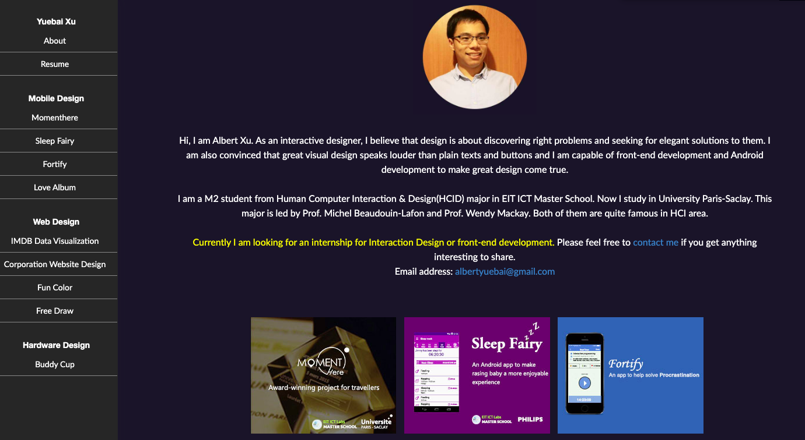
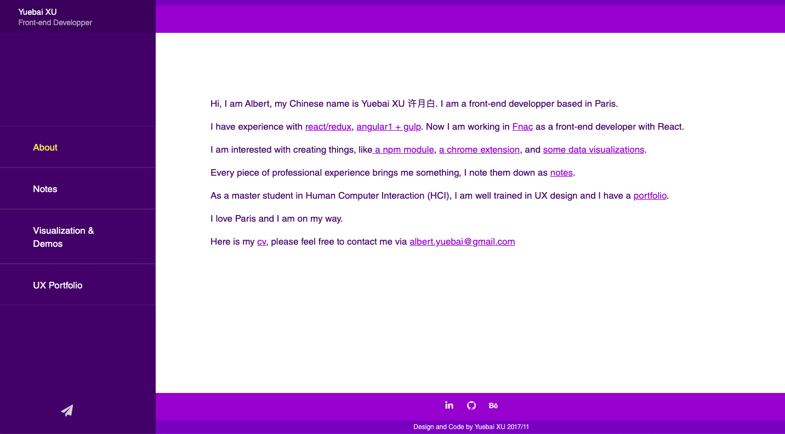

Recently I remade my blog with GatsbyJS. The main reason is that I don't want to create blog by writing html anymore. Gatsby has its [support to transformer markdown files into react pages](https://www.gatsbyjs.org/tutorial/part-six/). During the development with GatsbyJS, I find that GatsbyJS is really a treasure box with its [plugins](https://www.gatsbyjs.org/plugins/), its [support for web performance](https://www.gatsbyjs.org/tutorial/part-eight/), its logic of focusing on the web content instead of technical details and [its focus on the deployment since the beginning of its tutorial](https://www.gatsbyjs.org/tutorial/part-one/#deploying-a-gatsby-site). In this article I will talk a bit with my journey with GatsbyJS.

### Evolutions of my portfolio websites from 2015-2019

During 5 years, I made 4 versions of my portfolio website. Each new version is pushed by learning of new technology and build tools.

I can remember my first portfolio website when I was still a student from the master of "human computer interaction". The site is pure html, css and es5. At that time, for me front-end development is putting content in html, fixing css problems and adding simple interactions with javascript.

In my internship from pilotfish, I started to learn to use build tools. At that time, [gulp](https://gulpjs.com/) is really a hot choice, so my second website is built with gulp with improvement of development experience by gulp. However, ES6 is still not used.

After I learned React, I made my [third website with React](https://albertwhite.github.io/site/#/) with the boost of create-react-app. ES6 and react open a new world for front-end development. This portfolio website is also an experiment field to develop new features, like making animations with [react pose](https://www.npmjs.com/package/react-pose).

However, the problem with my third portfolio website, is that the structure is complicated just for making a simple blog, for example, it is also not easy to write a blog with html.

When GatsbyJS was recommended again by another developer, I started to think of the possibilities and made demos with it. During the demo, I found that the [famous blog](https://overreacted.io/) from Dan Abramov is also made of GatsbyJS. That's when I decided to remake my website with GatsbyJS.

### Some Good thing with GatsbyJS

#### 1. Good development experience

With GatsbyJS, there are many good practices about web development in the modern world.

For example:

1. It uses general css stylesheet (in browser-config) and css module or styled-component together to solve the problem of scope in css.
2. It uses shared Layout component, page component for each route, and shared basic component.
3. It is react based. That's a good thing for react developers.
4. There is no need to config routings and config webpack, so that we can concentrate on the content.
5. Its notion of data is very advanced: **"data is everything that lives outside a React component"** and data can come from API, database, CMS, local files...

#### 2. Ecosystem of [Plugin](https://www.gatsbyjs.org/plugins/)

GatsbyJS has its ecosystem of plugins. Plugins made the development for new features fast and comfortable. For example, it has [React-helmet](https://www.gatsbyjs.org/packages/gatsby-plugin-react-helmet/?=) for SEO, [sharp](https://www.gatsbyjs.org/packages/gatsby-plugin-sharp/?=sharp) for image quality, [google manifest](https://www.gatsbyjs.org/packages/gatsby-plugin-manifest/?=manife) for PWA...

#### 3. NodeJS and GraphQL

As a javascript developer, maybe you want to do more than just front-end development. GatsbyJS gives you the playground for NodeJS and GraphQL. In fact, data from component must be got by GraphQL. GatsbyJS also provides APIs for development with NodeJS, for example, [creating react pages from markdown files](https://www.gatsbyjs.org/tutorial/part-six/).

### GatsbyJS plugins in this website

- [gatsby-plugin-typography](https://www.gatsbyjs.org/packages/gatsby-plugin-typography/?=gatsby-plugin-typography): predefined css
- [gatsby-plugin-typescript](https://www.gatsbyjs.org/packages/gatsby-plugin-typescript/?=gatsby-plugin-typescript): support for typescript
- [gatsby-plugin-tslint](https://www.gatsbyjs.org/packages/gatsby-plugin-tslint/?=gatsby-plugin-tslint): support for tslint ([Tuto: Gatsby+Typescipt+Prettier](https://medium.com/maxime-heckel/getting-started-with-typescript-on-gatsby-8544b47c1d27))
- [gatsby-transformer-sharp](https://www.gatsbyjs.org/packages/gatsby-transformer-sharp/?=gatsby-transformer-sharp)
- [gatsby-plugin-sharp](https://www.gatsbyjs.org/packages/gatsby-plugin-sharp/?=gatsby-plugin-sharp): optimizing images
- [gatsby-source-filesystem](https://www.gatsbyjs.org/packages/gatsby-source-filesystem/?=gatsby-source-filesystem): load local resource
- [gatsby-transformer-remark](https://www.gatsbyjs.org/packages/gatsby-source-filesystem/?=gatsby-transformer-remark) : take raw content from markdown files to be used in app
- [gatsby-remark-prismjs](https://www.gatsbyjs.org/packages/gatsby-remark-prismjs/?=gatsby-remark-prismjs): highlight code in markdown files
- [gatsby-remark-images](https://www.gatsbyjs.org/packages/gatsby-remark-images/?=gatsby-remark-images): use images in markdown
- [gatsby-remark-copy-linked-files](https://www.gatsbyjs.org/packages/gatsby-remark-copy-linked-files/?=gatsby-remark-copy-linked-files): use inline images in markdown
- [gatsby-plugin-react-helmet](https://www.gatsbyjs.org/packages/gatsby-plugin-react-helmet/?=gatsby-plugin-react-helmet): SEO with react-like header management
- [gatsby-plugin-manifest](https://www.gatsbyjs.org/packages/gatsby-plugin-manifest/?=gatsby-plugin-manifest): PWA

The **darkmode** is hand-made and I took an idea from [here](https://www.gatsbyjs.org/packages/gatsby-plugin-dark-mode/?=darkmode).

### In the end

GatsbyJS makes it really comfortable to create a website, however, lots of things are hidden behind its configuration like routings, plugins... In real world, Web development is not that easy like with GatsbyJS.

Here is the [git repo](https://github.com/AlbertWhite/site-v2.0) for this website.

Thank you for reading!
