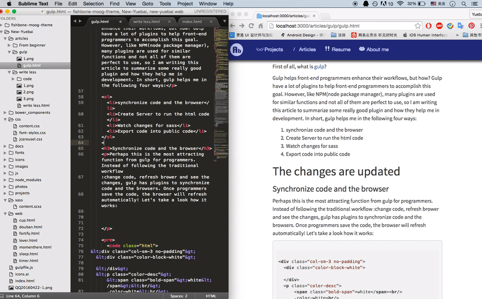

The first day I came to the office, I remember my tutor told me: have you ever tried to use gulp? We use gulp for our projects here.

I heard that before, but never tried with that at that time. However, after I try with it, I konw I will never code html without it until there is a better tool for me!


First of all, what is [gulp](http://www.gulpjs.com/}?

Gulp helps front-end programmers enhance their workflows, but how? Gulp have a lot of plugins to help front-end programmers to accomplish this goal. However, like NPM(node package manager), many plugins are used for similar functions and not all of them are perfect to use, so I am writing this article to summarize some really good plugin and how they help me in development. In short, gulp helps me in the following three ways:

1. Create server and synchronize code and the browser
2. Watch changes for sass
3. Export code into the version for public use

### Create server and synchronize code and the browser

Perhaps this is the most attracting function from gulp for programmers. Instead of following the traditional workflow :change code, refresh brower and see the changes, gulp has plugins to synchronize code and the browsers. Once programmers save the code, the browser will refresh automatically! Let's take a look how it works:


It's cool isn't it? This feature helps save a lot of time.

There are different ways to do that, but I recommend to use the plugin [browsersync](http://www.browsersync.io/) for this feature.

How to use it? First of all, we need to install gulp with $: npm install gulp and then install the plugin with $: npm install brower-sync.

After installing gulp, we can start creating the new file **gulpfile.js** to add code.

In order to create a simple server and synchronize code and browser, we just add a few line of code:

```js
var gulp = require("gulp")
var browserSync = require("browser-sync")
var reload = browserSync.reload

gulp.task("server", ["sass"], function() {
  browserSync({
    server: {
      //create server
      baseDir: ".", //set the dir for index.html
    },
  })
  gulp.watch("*.html", reload) //watch for changes in html and reload
})
```

After that, we just go to terminal, and run the command \$: gulp server to start the server.

More then that, browser-sync could be used for multiple devices, and it also supports synchronizing for inputs.

If you want to know more about this plugin, please view the its [website](http://www.browsersync.io/).

### Watch changes for sass

While we are using sass, maybe the most annoying problem is we always to export sass into css and then view the effects. As a result, there are many solutions to automatic the workflow, for example, [compass watch](http://compass-style.org/help/) could do a good job, but do you know, gulp could also provide a solution to that?

The plugin I am now introducing is [gulp-sass](https://www.npmjs.com/package/gulp-sass). This plugin could watch for the changes in sass and also report errors in sass.

As for the code, we can also write this part into the server task.

gulpfile.js

```js
var gulp = require("gulp")
var browserSync = require("browser-sync")
var sass = require("gulp-sass")
var reload = browserSync.reload

gulp.task("sass", function() {
  //create another task 'sass'

  gulp
    .src("sass/*.scss") //input
    .pipe(sass({ outputStyle: "compressed" }).on("error", sass.logError)) //set the output format
    .pipe(gulp.dest("css/"))

  reload()
})

gulp.task("server", ["sass"], function() {
  browserSync({
    server: {
      baseDir: ".", //set the dir for index.html
    },
  })
  gulp.watch("sass/*.scss", ["sass"]) //use 'sass' task to deal with changes in sass
  gulp.watch("*.html", reload)
})
```

### Export code into the version for public use

As we know, some files are just for programming use, such as gulpfile.js, sass files, npm packages.. They are not for public use, and we need to get rid of them when we export the code for public use.

We can establish a task called 'export' for this, and everytime we want to export the code, we can use this task.

gulpfile.js

```js
var gulp = require("gulp")

gulp.task("export", function() {
  gulp
    .src("css/*.css") //input files
    .pipe(gulp.dest("public+/dist/css")) //output files

  gulp
    .src("html/*.html") //input files
    .pipe(gulp.dest("public+/dist/html")) //output files

  gulp
    .src("js/*.js") //input files
    .pipe(gulp.dest("public+/dist/js")) //output files
})
```

As we can see, the **src** and **pipe** functions could be used to move files with gulp. They are documented **here**.

### Combine gulp and node server

As we mentioned above, gulp is only for automating the workflow. The plugins are used for that, but what if we also want to use node to eastablish servers and use packages in node to accomplish the tasks with node?

If we want to do this, the server by gulp is not enough, we still need express.js to create server.

For example, we want to establish a server which can listen to the post method from html. It can be done in this way:

gulpfile.js

```js
var gulp = require('gulp');
var express = require('express');

gulp.task('express',function(){
  var express = require('express');
  var app = express();
  app.use(express.static(__dirname));//serve static files in express
  app.use(bodyParser());

  app.listen(4000);

  app.post('/', function(req, res) {
    var name = req.body.name;
    var email = req.body.email;
    var type= req.body.type;
    var body = req.body.body;

    var options = {
      'name':name,
      'email':email,
      'body':body
    };
    return mail(options);
  });
});
});
```

Gulp is very useful to automate front-end developers' workflow. Hope you like it!
