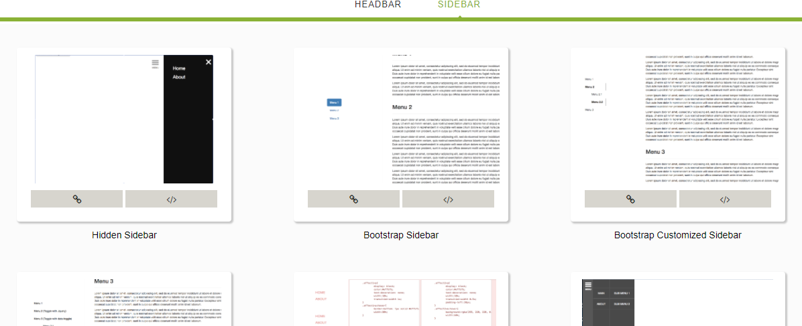

Recently, I start to discover the common practice for web design and web development. I find that almost all the articles about web design talk about how it looks like, but don't talk about how to make the implementation. I did some work to summarize the common pratice for header and sidebar in the view of web design also of web development.

[Here](https://albertwhite.github.io/common-practice-for-headbar-and-sidebar/) is the project.

Thanks for reading!
