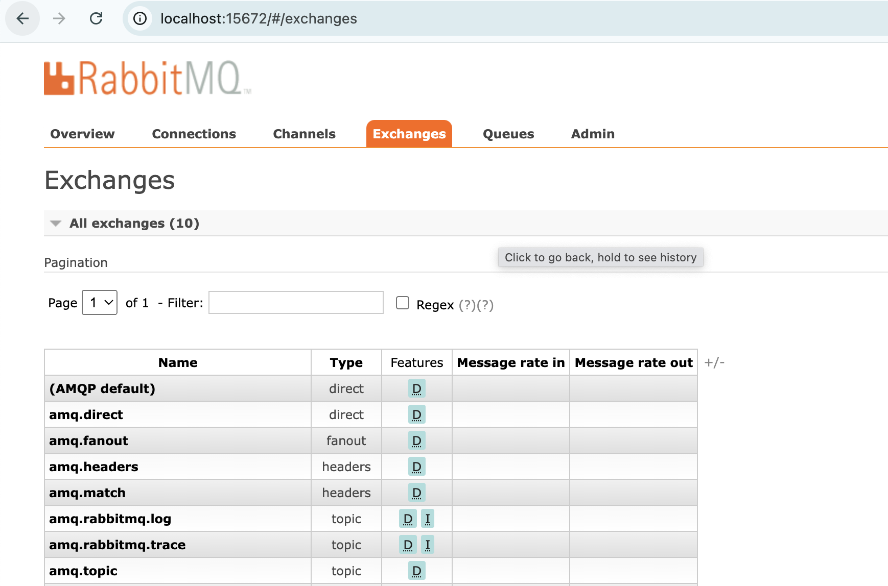
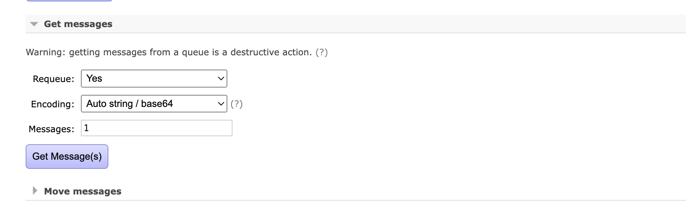
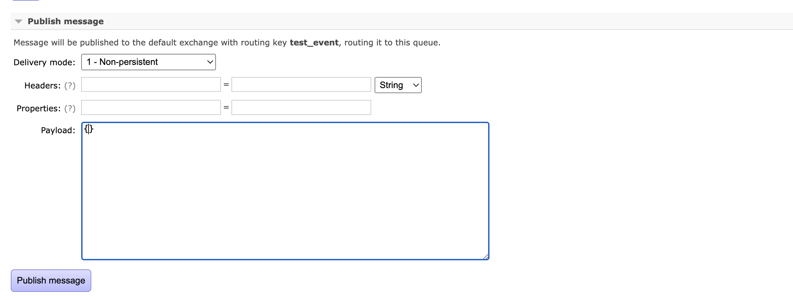

Rabbitmq is the key to event driven distributed system, especially for communications between micro-services.

However, while developing, it is always the case that we don't see any message coming, and worker is not handling anything. Since sending the message, dispatching the message and consuming the message are totally behind the scene, debugging rabbitmq message is not an easy task. In this article, I am going to explain a concrete way to solve this problem.

## Basic introduction: Exchange and Queue

Exchange is like a specific channel to receive messages. One exchange can be used to listen to different messages through binding, and each **binding** between a message (or **routing key**) will create a specific **queue**.

In short, one exchange can be involved with multiple queues, each queue stands for a binding between an exchange and a routing key, and Rabbitmq is the broker to dispatch messages to specific queues.

## How to debug

What happens when a message is not received by a worker ? Don't worry, let's break the whole flow into different steps.

### Step 1: Launch rabbitmq locally and send the message

Let's imagine that we have a service, and a worker. Service will dispatch an message, and worker will consumer that message.

First of all, let's launch the service via docker-compose locally, with docker-compose, it should launch the rabbitmq locally as well. Let's open the rabbitmq locally and login, the localhost port and credentials should be found from docker-compose file.

Before sending the message, let's remove any real consumer for this message, which means, do not start the worker yet to handle the message. This will make sure that the message will be not handled and stay as queued messages.

### Step 2: Get the message and check the payload in Rabbitmq

Once we launch the rabbitmq locally and send the message, we should be able to see the message inside queued message. In RabbitMQ, it's possible to get the message payload by clicking on **Get Messages**.

Once we get the message payload, it is possible to verify if the payload is correct. If the payload is correct, but the worker still cannot handle the message correctly, then the problem is on the consumer side.

### Step 3: Publish the message manually and check the consumer

First of all, let's save the payload from the last message somewhere, it will be used when we publish the message by hand to test the consumer.

Now, let's stop the service locally, and launch the consumer (worker), the rabbitmq should be always running.

In the same queue, let's publish the message with the saved payload, and check the logs from the worker. And that's it !

Thanks for reading !
