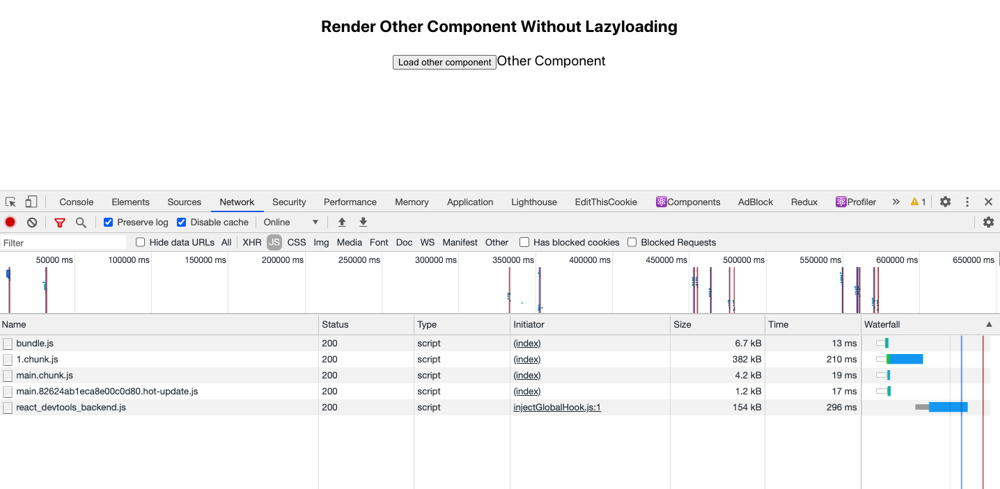
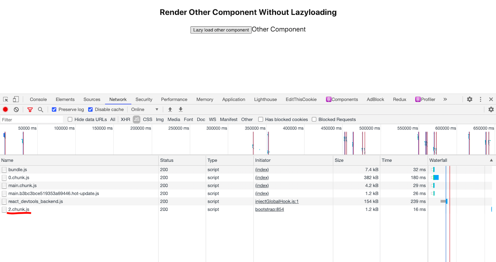

React.Lazy is a React official API for lazy load component / dynamic import bundle. In this article, I will show a real simple example on how react lazy helps with web performance.

Here is the API for [React Lazy](https://reactjs.org/docs/code-splitting.html#reactlazy).

Imagine a very simple example: there is a component, and it shows only after we click on a button.

If we import this component in this normal way:

`import Other from 'other'`

then all the bundle will be loaded only once, as the image shows:



However, if we load the 'Other Component' in the React.lazy way:

```js
 const OtherComponent = React.lazy(() => import("./Other"))

 <Suspense fallback={<div>Loading...</div>}> // must wrap in React.Suspense
    <OtherComponent />
  </Suspense>`
```

Then there is a new bundle '2.chunk.js' loaded on showing the other component after clicking on the button. It helps with splitting the bundle.



Here is the full example:

```js
export default () => {
  const [showOtherComponent, setShowOtherComponent] = React.useState(false)
  const OtherComponent = React.lazy(() => import("./Other"))

  return (
    <>
      <div className="App">
        <h3>Render Other Component Without Lazyloading</h3>
        <div>
          <button
            onClick={() => {
              setShowOtherComponent(true)
            }}
          >
            Lazy load other component
          </button>
          {showOtherComponent && (
            <Suspense fallback={<div>Loading...</div>}>
              <OtherComponent />
            </Suspense>
          )}
        </div>
      </div>
    </>
  )
}
```

Thanks for reading !
