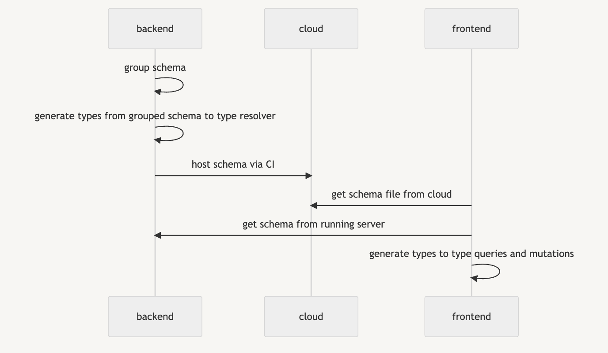

Graphql has its own type system, and converting it to typescript will make life easier. There are many tools to do that, including [graphql-codegen](https://the-guild.dev/graphql/codegen) or [apollo codegen:generate](https://www.apollographql.com/blog/tooling/apollo-codegen/typescript-graphql-code-generator-generate-graphql-types/). 

However, in this article, I will focus less on the "tool" side, but focus on a global vision on how graphql schema and types work in the backend side and frontend side.

### Before generating types in the backend: Load separated schema to a grouped schema

What is a graphql schema ? It's a `.graphql` file containing graphql type definition.

It's a common practice to not write all of your schemas into one file, but to split them into functional scope based folders and to use the `#import` syntax. In this case, we need to group the separated schemas into a grouped schema. Once we have the grouped schema, then we could use it to build the graphql server (by passing to typeDefs param), or creating typescript types from it.

[There is a really nice article](https://the-guild.dev/graphql/tools/docs/schema-loading) about how to load graphql schemas from different sources. In general, we will need `loadSchemaSync` function from `graphql-tools/load` library and `@graphql-tools/graphql-file-loader` library.

### Generate typescript types from the grouped schema in the Backend

Once we have the grouped schema, then we could generate types from it. There are multiple libraries to do that, most commonly, [graphql-codegen](https://the-guild.dev/graphql/codegen). The generated types are mostly used in resolvers and data model layers.

### Pass the schema from Backend to frontend: How Frontend gets the schema to generate typescript types

Once the backend is released, then the graphql schema is ready to be fetched for the frontend to generate types.
If we use graphql-codegen, there are several ways to load the schema:
- In the schema field, use the server localhost url `http://localhost:3000/graphql`, in this case we need to set up server to get schema.
- Get the schema from preprod environment, use the url `https://api.preprod.xx/graphql`, the advantage is we don't need to set up the server, but the thing is that the preprod schema could be misleading.
- Use a static file path. But in this case we need to download the schema first. For example, the schema could be uploaded into a cloud by the CI for each backend release.

### Generate types in the frontend

In the Frontend, sometimes we don't want to generate all types into only one file. In this case, [graphql-codegen](https://the-guild.dev/graphql/codegen) provides a [plugin](@graphql-codegen/near-operation-file-preset) to improve the situation. The generated types will be created into separate files, besides each usage of query or mutation. It will make type importing much easier.

### Conclusion

I have created a mermaid graph to explain the best practice on it:

Thanks for reading !
