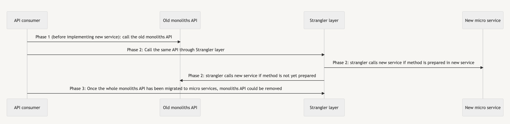
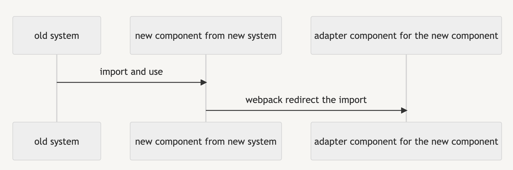

[Strangler pattern](https://www.redhat.com/architect/pros-and-cons-strangler-architecture-pattern) is a useful pattern when we refactor the code base behind without touching the API. Recently I have touched two totally different examples from backend and frontend. They are quite different but share the same idea.

### Backend Example

Imagine if we want to cut a monoliths API into multiple micro-services, while not changing the API consumer (Web, Apps) right away.

We create the strangler layer to keep the same API, but behind the strangler layer will call the old monoliths API or call new micro-service, depending on the micro-service migration. **This change is invisible to the API consumer side**, which is the advantage of this pattern.

### Frontend example

Imagine when you are migrating your website into a new framework, the new framework provides some new component which is not yet supported by the old framework. You need to implement the new component into the old framework without crashing the old framework.

In this case, we could do something in `webpack` and replace the reference of the new component to a placeholder component which is still supported by the old framework. See ? It's the same idea as Strangle pattern: change the things behind, and make the change invisible on the consumer side.

### Conclusion

Strangler pattern is useful in the refactor of a huge system, by creating the layer in the middle, API consumer could use the API as it wants, while the only change is in the "backend".  
