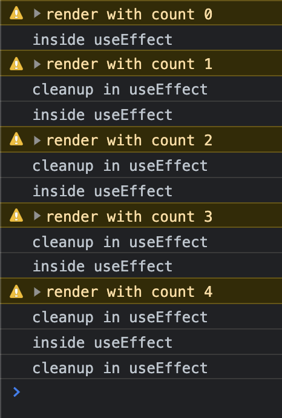
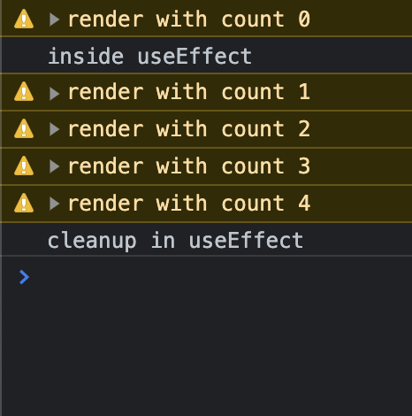

Some quick FAQs to share my test results.

### 1. Does then clean up function only occur on componentUnMount?

No. It occurs not just when a component unmounts, but also when useEffect reruns.

### 2. Does the clean up function depend on useEffect dependencies ?

Yes and No.
When component unmounts, the clean up function will surely be called.
When useEffect reruns (when dependencies update), clean up function will also run.

### 3. What is the order of component render, useEffect and clean up ?

Render -> useEffect -> reRender -> cleanup -> useEffect.

[Here](https://github.com/AlbertWhite/react-demos/blob/master/demo50-useeffect-cleanup/src/App.js) is my test code.

```js
import React, { useState, useEffect } from "react"

const App = () => {
  const [count, setCount] = useState(0)

  return (
    <>
      <button onClick={() => setCount(count + 1)}>update count</button>
      {count !== 5 && <InsideApp count={count} />}
    </>
  )
}

const InsideApp = ({ count }) => {
  useEffect(() => {
    console.log("inside useEffect")

    return () => {
      console.log("cleanup in useEffect")
    }
  }, [count])

  console.warn(`render with count ${count}`)
  return <div>{count}</div>
}

export default App
```

Test results when "count" is dependency in useEffect:


Test results when dependency array is array in useEffect:


Thanks for reading !
