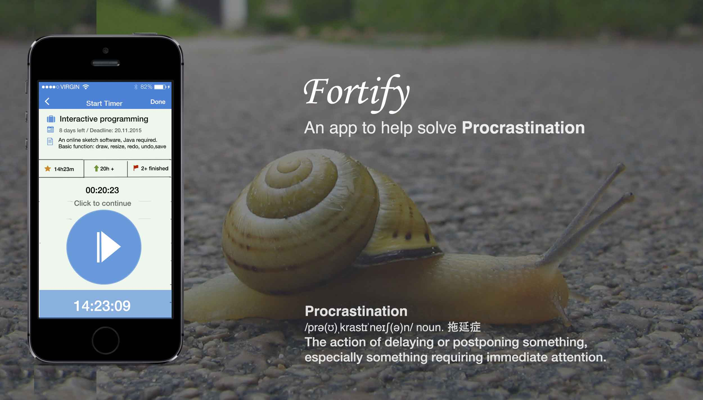
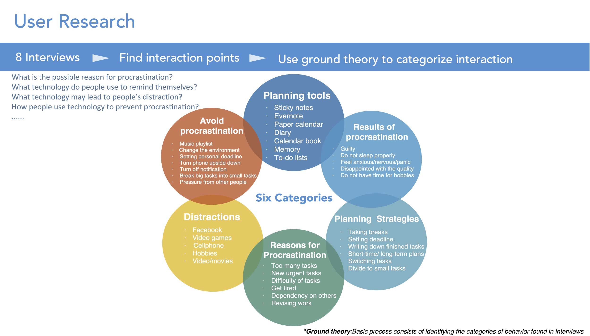
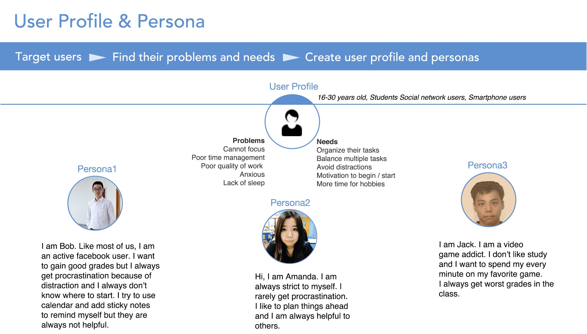
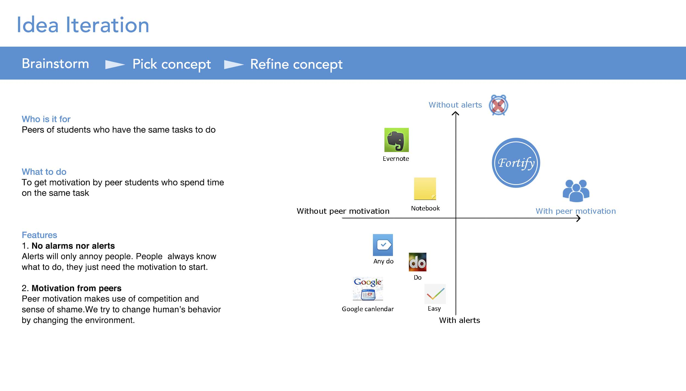
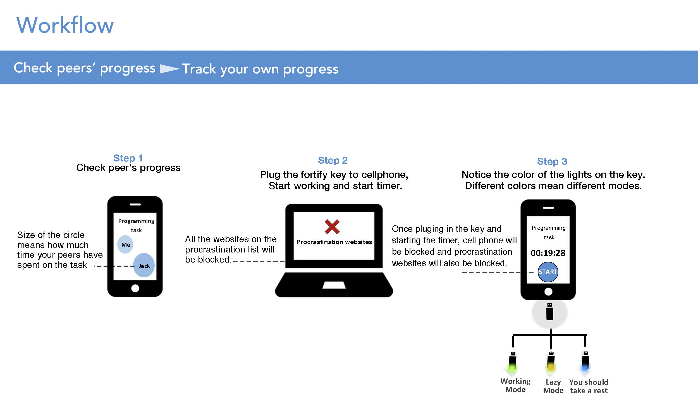
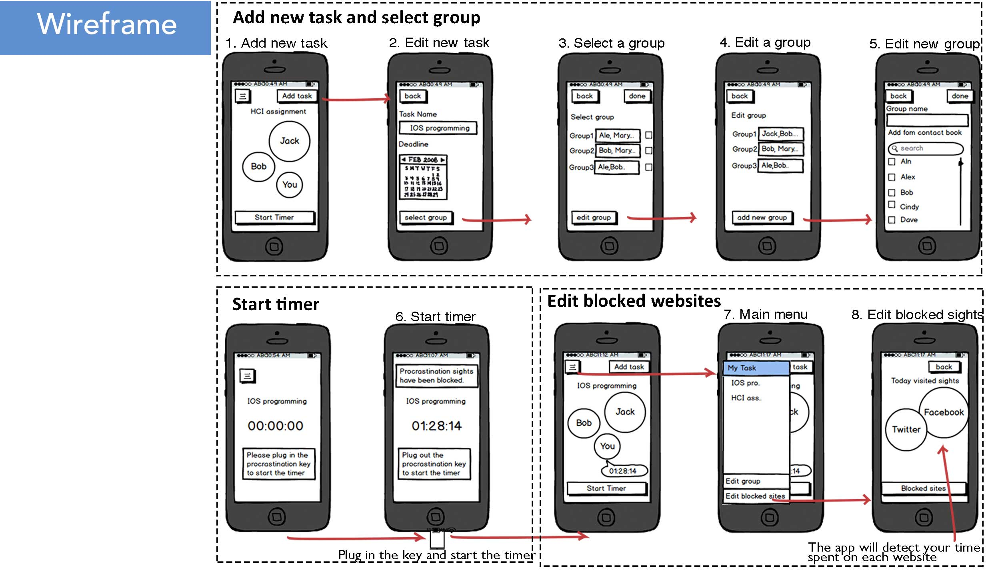
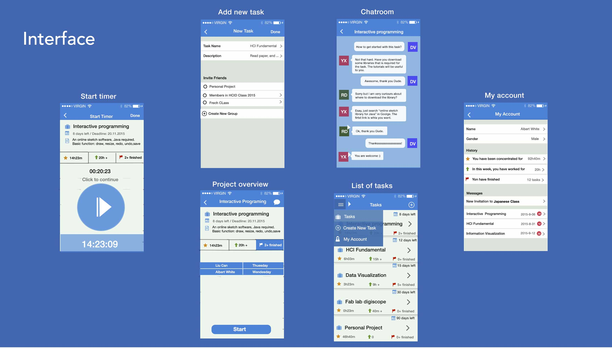

Fortify is a mobile app to help people from procrastination. It makes use of peer pressure and has no annoying alerts to users. Fortify is the team project from design class by Prof. Wendy MACKAY in 2014.

The most valuable thing I learned in this process is finding the right problem. The common solution for procrastination is making a to do list with alerts for reminding people of the tasks. However, the problem is not "don't know what to do", but "don't want to do". Just showing the todo list doesn't work, because the real problem lies in the lack of motivation.

